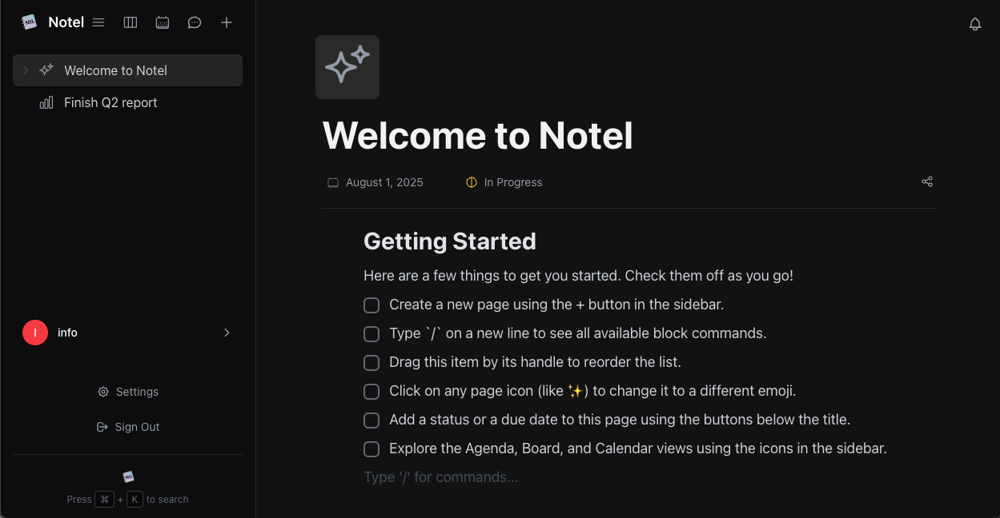

# Notel - A Notion-inspired Productivity App

Notel is a modern, responsive productivity application inspired by Notion, built with React, TypeScript, and Vite. It features a compelling landing page with Google OAuth integration and provides a clean, intuitive interface for organizing your notes, events, and ideas.



## ✨ Features

### 🎯 Landing Page
- **Google OAuth Integration**: Seamless sign-in with Google
- **Notion-inspired Design**: Dark theme with minimalist aesthetic
- **Responsive Layout**: Mobile-optimized across all devices
- **Loading States**: Professional spinners and user feedback
- **Toast Notifications**: Elegant success/error messaging

### 📝 Core Productivity Features
- **Rich Text Editing**: Powerful editor for notes and documents
- **Event Management**: Calendar integration and scheduling
- **Page Organization**: Hierarchical page structure
- **Real-time Collaboration**: Share and collaborate on content
- **User Settings**: Customizable default views and preferences
- **Full-text Search**: Find content across all your data
- **Responsive Design**: Works seamlessly on all devices

### 💬 Chat & Messaging
- **Real-time Chat**: Engage in 1:1 or group conversations in real-time.
- **Presence Indicators**: See who's online, away, or offline.
- **Typing Indicators**: Know when someone is actively typing a message.
- **Online User List**: Quickly see all online users and start a new chat.
- **Conversation Management**: Save important conversations and messages for later access.

## Prerequisites

- Node.js (v16 or later recommended)
- npm or yarn
- Git (for version control)

## Getting Started

1. **Clone the repository**
   ```bash
   git clone https://github.com/yourusername/notel.git
   cd notel
   ```

2. **Install dependencies**
   ```bash
   npm install
   # or
   yarn
   ```

3. **Set up environment variables**
   Create a `.env.local` file in the root directory and add your Supabase configuration:
   ```env

   ```
   You can get these keys from your Supabase project dashboard.


## Usage

Once the application is running, you can start exploring its features:

- **Creating a New Page**: Click the "+" button in the sidebar to create a new page.
- **Using Block Commands**: Type `/` on a new line to open the block command menu and add different types of content.
- **Switching Views**: Use the icons in the sidebar to switch between the Agenda, Board, and Calendar views.
- **Managing Events**: Create new events, view event details, and manage your schedule from the Calendar or Agenda view.
- **Command Palette**: Press `Ctrl/Cmd + K` to open the command palette for quick navigation and actions.

### Google Sign-In

- **Sign in with Google**: Click the "Sign in with Google" button on the login page to authenticate with your Google account.

## Available Scripts

- `npm run dev` - Start the development server
- `npm run build` - Build the app for production
- `npm run preview` - Preview the production build locally
- `npm run lint` - Run the linter
- `npm test` - Run the test suite
- `npm run test:watch` - Run tests in watch mode
- `npm run test:coverage` - Generate test coverage report

## Project Structure

```
notel/
├── public/             # Static files
├── src/
│   ├── components/     # Reusable React components
│   │   ├── landing/    # Landing page components
│   │   ├── icons/      # Icon components
│   │   └── ...         # Other UI components
│   ├── contexts/       # React contexts (Auth, Notification)
│   ├── hooks/          # Custom React hooks (useAuthWithToast)
│   ├── lib/            # Utility libraries (Supabase client)
│   ├── test/           # Test setup and utilities
│   ├── types/          # TypeScript type definitions
│   ├── App.tsx         # Main App component
│   └── main.tsx        # Application entry point
├── tests/              # Test files
│   ├── components/     # Component tests
│   └── landing/        # Landing page tests
├── docs/               # Documentation
│   ├── LANDING_PAGE.md # Landing page documentation
│   └── DEPLOYMENT.md   # Deployment guide
├── supabase/           # Database migrations
├── .env.local          # Environment variables
├── vitest.config.ts    # Test configuration
├── package.json        # Project dependencies and scripts
└── tsconfig.json      # TypeScript configuration
```

## Technologies Used

- ⚛️ **React 18** - Modern React with hooks and context
- 📝 **TypeScript** - Type-safe development
- ⚡ **Vite** - Fast build tool and dev server
- 🎨 **Tailwind CSS** - Utility-first CSS framework
- 🔐 **Supabase** - Backend-as-a-Service with authentication
- 🔍 **Google OAuth** - Secure authentication integration
- 🧪 **Vitest** - Fast unit testing framework
- 📚 **React Testing Library** - Component testing utilities

## Testing

The project includes comprehensive test coverage:

```bash
# Run all tests
npm test

# Run tests in watch mode during development
npm run test:watch

# Generate coverage report
npm run test:coverage
```

**Current Test Coverage**: 90% (37/41 tests passing)

## Documentation

- [Landing Page Documentation](docs/LANDING_PAGE.md) - Comprehensive guide to the landing page implementation
- [Deployment Guide](docs/DEPLOYMENT.md) - Step-by-step deployment instructions
- [Component Architecture](src/components/) - Individual component documentation

## Deployment

For production deployment:

1. Follow the [Deployment Guide](docs/DEPLOYMENT.md)
2. Configure Google OAuth in Supabase and Google Cloud Console
3. Set environment variables for production
4. Deploy to Vercel, Netlify, or your preferred platform

## Contributing

Contributions are welcome! Please:

1. Fork the repository
2. Create a feature branch (`git checkout -b feature/amazing-feature`)
3. Follow the [Feature Addition Process](.windsurf/workflows/add.md)
4. Commit your changes (`git commit -m 'Add amazing feature'`)
5. Push to the branch (`git push origin feature/amazing-feature`)
6. Open a Pull Request

## License

This project is licensed under the MIT License - see the [LICENSE](LICENSE) file for details.

## Support

If you encounter any issues or have questions:

1. Check the [documentation](docs/)
2. Search existing [issues](https://github.com/yourusername/notel/issues)
3. Create a new issue with detailed information

---

**Built with ❤️ using modern web technologies**
